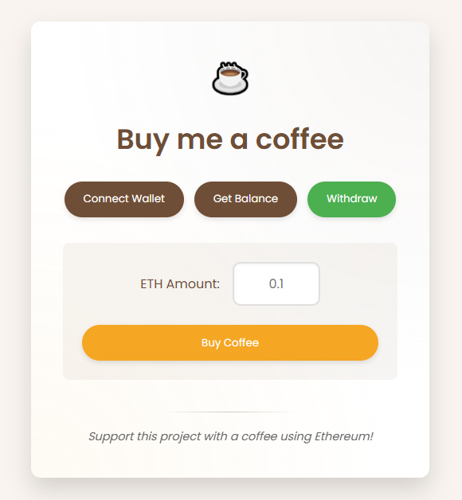

# ☕ Buy Me A Coffee - Web3 dApp


A modern, stylish web3 application that allows users to send ETH tips (like buying a coffee) through blockchain transactions. This project showcases frontend development with Web3 integration.

## 🚀 Features

- **Connect Wallet**: Seamlessly connect your Ethereum wallet
- **Check Balance**: View contract balance in real-time
- **Send ETH**: Make coffee-sized donations through the blockchain
- **Modern UI**: Clean, responsive design with coffee-themed styling

## 🖼️ Preview



## 🛠️ Tech Stack

- **Frontend**: HTML5, CSS3, JavaScript
- **Web3**: Ethereum blockchain integration
- **Styling**: Custom CSS with responsive design

## 📋 How It Works

1. Connect your MetaMask or other Web3 wallet
2. Check the current balance of the smart contract
3. Enter the desired ETH amount to contribute
4. Click "Buy Coffee" to send the transaction
5. Your contribution is recorded on the blockchain!

## 🔧 Installation and Setup

```bash
# Clone the repository
git clone https://github.com/jucileycostaweb3/html-ts-coffee.git

# Navigate to the project directory
cd html-ts-coffee

# Anvil
pnpm anvil

# Run app
pnpm dev
```

## 📝 Smart Contract Integration

This frontend connects to a Solidity smart contract deployed on the Ethereum blockchain. The contract handles:

- Receiving and storing ETH donations
- Tracking contributors
- Managing withdrawals

## 📄 License

This project is [MIT](LICENSE) licensed.

## 👨‍💻 Author

- **Your Name** - [GitHub Profile](https://github.com/jucileycostaweb3)

---

⭐️ If you found this project useful, please consider giving it a star on GitHub! ⭐️
